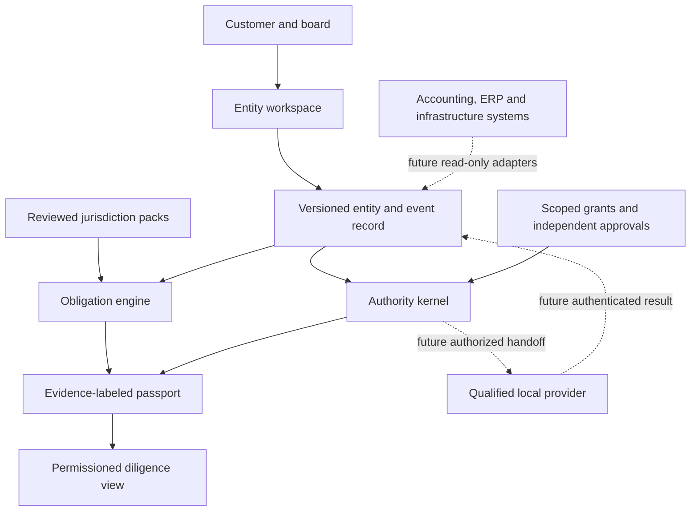

# Entity Continuity

**An inspectable reference engine for entity obligations, delegated authority, and evidence status.**

Entity Continuity is the proposed open-source foundation for a cross-border entity operating network. It models a company's lifecycle as events, evaluates jurisdiction-specific obligation rules, checks proposed actions against scoped grants and independent approvals, and emits a deterministic receipt. The commercial vision is a managed network of qualified formation, legal, accounting, filing, and infrastructure providers. The reference engine does not replace those providers.

> **Current evidence boundary:** v0.2 runs only local, synthetic cases and can recompute a receipt from the exact local inputs. Its `US-DE-SYNTHETIC` pack contains invented deadlines and is **not a Delaware filing calendar**. It does not connect to a registry, authenticate a person, verify a provider, execute a filing, or provide legal or tax advice. The `reviewable` result means a local rule passed, not that an action is authorized in the real world.

## Run the case study

Python 3.11+ is sufficient; the runtime has no third-party dependencies.

```bash
PYTHONPATH=src python3 -m entity_continuity.cli \
  examples/egypt-to-us-synthetic-case.json \
  examples/us-de-synthetic-pack.json \
  --as-of 2026-09-23 --output /tmp/entity-continuity-passport.json

PYTHONPATH=src python3 -m entity_continuity.verify_cli \
  examples/egypt-to-us-synthetic-case.json \
  examples/us-de-synthetic-pack.json \
  /tmp/entity-continuity-passport.json --as-of 2026-09-23

PYTHONPATH=src python3 -m unittest discover -s tests -v
```

The case represents an Egypt-based founder with a synthetic US entity. It tests two obligations: an open post-formation review with uploaded but unverified evidence, and an overdue ownership-change review. One provider-review request is locally reviewable; an agent's proposed filing is denied because it lacks a scoped grant and independent approval. All names, dates, deadlines and events are synthetic.

## Architecture



Solid lines describe the local reference design. Dotted lines are proposed integrations; no provider or production system is connected in v0.2. A production handoff would require identity verification, authenticated approvals, provider agreements, jurisdiction-specific review, durable storage, and operational controls.

The [expanded Entity Continuity Network architecture](docs/NETWORK_ARCHITECTURE.md) maps the OSS kernel, commercial compartments, authority lifecycle, jurisdiction-pack release process, and economic feedback loop. Its **evidence and authority data model uses explicitly dark, high-contrast record boxes** for readable field labels on GitHub.

## Core contracts

| Contract | Required meaning | v0.2 treatment |
| --- | --- | --- |
| Entity | Stable ID and jurisdiction | Exactly one entity per case |
| Event | Entity-bound occurrence and date | Drives rule evaluation |
| Jurisdiction pack | Version, effective date, trigger, due interval and official reference | Only packs explicitly marked `SYNTHETIC_REFERENCE` accepted |
| Obligation | Rule/event pair with due date and evidence status | Deadline status is `open` or `overdue`; evidence status is `missing`, `reported`, or `verification_claimed` |
| Grant | Principal, entity, action list and expiry | Locally evaluated; identity not authenticated |
| Approval | Independent actor, entity, intent and decision | Self-approval denied; identity not authenticated |
| Intent | Proposed actor and action | `deny` or `reviewable`, never production authorization |
| Receipt | Canonical input and output SHA-256 digests | Detects changed bytes during local replay; not a signature |
| Verifier | Full recomputation from exact case, pack and date | Local synthetic consistency only; no source or identity authentication |

Evidence statuses are deliberately conservative. A customer upload does not complete an obligation or suppress an overdue flag. Even an input claiming a registry record yields `verification_claimed` because this release cannot authenticate its origin. See [data and trust boundaries](docs/ARCHITECTURE.md).

## Project boundaries

The open-source product should retain the schemas, deterministic engines, policy semantics, reference adapters, synthetic benchmarks, and redacted passport format. This lets buyers, service providers and auditors inspect the basis of every decision. The commercial service can charge for managed workspaces, secure integrations, locally maintained rule packs, qualified provider coordination, human review, authenticated filings, support and evidence-backed diligence rooms. Neither tier should present AI output as professional advice without a qualified professional's review.

The first corridor is **Egypt-based founders operating a US entity**. Next corridors should be selected by observed customer demand and qualified partner capacity, not a claim of blanket worldwide coverage. Singapore's corporate-service-provider rules, Delaware's registered-agent role, and country-specific EU registration requirements illustrate why the product needs distinct packs and qualified local partners. [ACRA](https://www.acra.gov.sg/register/corporate-service-provider/checking-if-you-must-register/), [Delaware Division of Corporations](https://corp.delaware.gov/faqs-regarding-registered-agents/), [Your Europe](https://europa.eu/youreurope/business/lifecycle/starting/registration-permits-licences/indexamp_en.htm).

## Ecosystem integration plan

| Existing project | Proposed interface | Current reality |
| --- | --- | --- |
| [GRC Claw](https://github.com/AAH20/GRC_Claw) | Governance controls and evidence mapping | No live Entity Continuity adapter |
| [Agent Trust Fabric](https://github.com/AAH20/agent-trust-fabric) | Scoped action-intent receipt import | Its local receipts are not authenticated production evidence |
| [AI Governance Evidence Graph](https://github.com/AAH20/ai-governance-evidence-graph) | Claim-to-evidence assurance cases | No live adapter |
| [RunProof](https://github.com/AAH20/runproof) | AI-deployment passport attachment | Current public case is synthetic |
| [WorldOps](https://github.com/AAH20/worldops) | Infrastructure decision receipt attachment | Current facility world is synthetic |
| Accounting and ERP providers | Read-only ledger and entity metadata imports | No connector in v0.2 |

## Evaluation and expansion gates

1. **Reference release:** synthetic replay, fail-closed input validation, deny self-approval and expired grants, clear evidence labels, and offline receipt recomputation. Implemented locally in v0.2.
2. **Expert-checked packs:** locally qualified reviewers approve source-linked rules; regression tests cover effective dates, entity types, exceptions and superseded rules. Not implemented.
3. **Read-only pilot:** import real customer-authorized records; measure missing evidence, false reminders, deadline accuracy and time to a diligence packet. Not implemented.
4. **Provider handoff:** authenticate customer and provider, sign approvals, apply separation of duties, record filing references and escalation SLAs. Not implemented.
5. **Multi-jurisdiction operations:** country-specific legal and data-handling review, provider scorecards, dispute handling and verified unit economics. Not implemented.

Suggested pilot KPIs are missed statutory obligations (target zero), false reminder rate, time to resolve a missing document, professional review minutes per case, provider on-time rate, verified completion rate and contribution margin per entity-year. Targets require real baselines before publication. No growth rate or compliance outcome is guaranteed by the reference engine.

## Commercial economics to validate

Measure recurring contribution separately from pass-through charges:

`annual workspace revenue + coordination revenue - provider delivery - human review - connector maintenance - compute/storage - support - payment costs`

Government fees, legal fees and infrastructure purchases are disclosed separately. A partner referral is not treated as a high-margin software sale. Track customer-acquisition cost and payback using actual paid cohorts, and disclose referral incentives or preferred-provider relationships to customers.

## License and security

MIT. Do not place customer identity documents, credentials, legal advice, or private filings in this repository. This reference does not process secrets or connect to external systems. Security and privacy design for a hosted service must be reviewed before real client data is accepted.
