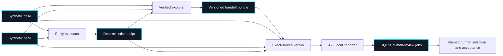
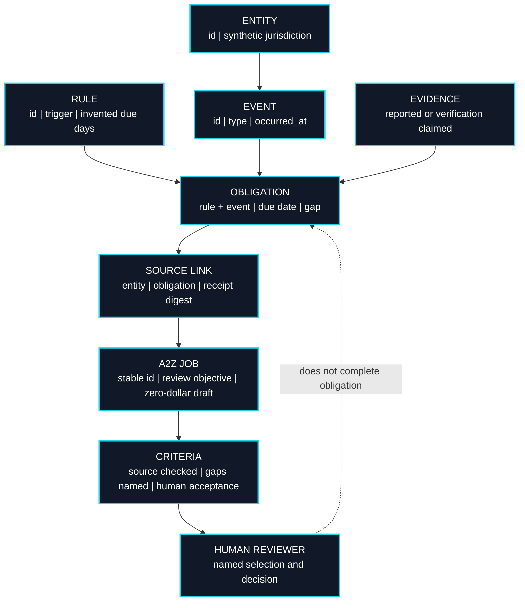
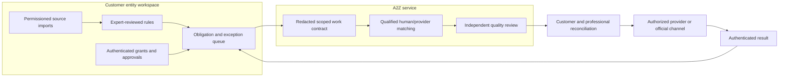

# Entity Continuity × A2Z Agent Hire

This offline integration turns a **synthetic entity obligation** into a **human-review job draft**. A job asks someone to examine an evidence gap; it is not a filing, legal conclusion, spending approval, or delegated authority. The exact case, pack, date and receipt must be retained for verification.

## Implemented flow



The exporter verifies the receipt and recomputes the **v2 bundle**. The A2Z import command requires all source artifacts and rechecks them before writing to local SQLite. The handoff manifest, source mappings and jobs are written in one transaction. Reimporting an identical bundle is idempotent; a conflicting job ID or changed stored contract is rejected. No network request or external action occurs.

## Data and authority



Generated jobs permit only `human` workers. Price, budget and all seven estimated cost fields are explicitly zero; these are drafts, not measured economic outcomes. An accepted A2Z review does not change the Entity Continuity obligation state.

## Reproduce end to end

From the Entity Continuity repository:

```bash
PYTHONPATH=src python3 -m entity_continuity.cli \
  examples/egypt-to-us-synthetic-case.json examples/us-de-synthetic-pack.json \
  --as-of 2026-09-23 --output /tmp/entity-receipt.json
PYTHONPATH=src python3 -m entity_continuity.a2z_cli \
  examples/egypt-to-us-synthetic-case.json examples/us-de-synthetic-pack.json \
  /tmp/entity-receipt.json --as-of 2026-09-23 --output /tmp/entity-a2z-bundle.json
```

From a sibling A2Z Agent Hire checkout:

```bash
PYTHONPATH=.:../entity-continuity/src python3 -m apps.api.import_entity_continuity \
  /tmp/entity-a2z-bundle.json \
  --case ../entity-continuity/examples/egypt-to-us-synthetic-case.json \
  --pack ../entity-continuity/examples/us-de-synthetic-pack.json \
  --receipt /tmp/entity-receipt.json --as-of 2026-09-23 --dry-run

PYTHONPATH=.:../entity-continuity/src python3 -m apps.api.import_entity_continuity \
  /tmp/entity-a2z-bundle.json \
  --case ../entity-continuity/examples/egypt-to-us-synthetic-case.json \
  --pack ../entity-continuity/examples/us-de-synthetic-pack.json \
  --receipt /tmp/entity-receipt.json --as-of 2026-09-23 \
  --db /tmp/a2z-agent-hire-entity-demo.db
```

The resulting jobs appear in A2Z's local job list. Run its server with `--no-demo-seed` to keep fictional jobs and workers out of this database. Import does not launch a run or select a worker. Older v1 bundles must be regenerated with v0.5; a database containing v1 jobs requires a reviewed migration or a separate clean demo database. Real customer records should never go into these public fixtures.

For an exact source-manifest trail, first produce a synthetic [read-only intake record](READ_ONLY_INTAKE.md), then pass `--intake-manifest` and `--intake-record` to the A2Z import command. A2Z replays that intake and stores its digest and workspace reference with the bundle. This links review work to the declared source inventory; it does not authenticate consent or isolate tenants.

## Future production architecture



All nodes in this diagram are **proposed** except the local synthetic evaluator, bundle exporter, local importer and A2Z reference job lifecycle. No real jurisdiction pack, identity proof, provider qualification, source authentication, official filing connection or commercial settlement exists here.

## Release gates and measures

| Gate | Required proof | Measure |
| --- | --- | --- |
| Contract fidelity | Independent replay of case, pack, receipt and handoff | Rejected alterations; duplicate-safe imports |
| Qualified rules | Official-source mapping and named local professional review | False reminders and missed obligations |
| Customer-authorized pilot | Consent, minimization, encrypted storage, deletion and access review | Reconciliation coverage and evidence-gap resolution time |
| Provider handoff | Authenticated principal, signed scope, separation of duties and provider acceptance | Unauthorized actions and review turnaround |
| Commercial viability | Paid cohort with pass-through costs separated | Contribution per entity-year, review minutes, rework and renewal |

The repeatable commercial unit is an **entity-year** with review tasks measured separately. Revenue must be compared with provider delivery, professional review, connector operations, storage, support, payment costs and rework. Government and professional fees are not software margin. Current fixtures provide no real demand, price, accuracy or growth evidence.

## Failure handling

- A digest detects changed local bytes during replay; it does not authenticate a source.
- A2Z acceptance means a deliverable was accepted, never that a filing or legal obligation was completed.
- A changed pack or date requires a new receipt and job draft.
- A conflicting stable job ID stops import rather than overwriting prior work.
- Real source content needs redaction before worker distribution. Never put identity documents, credentials, private legal advice or filing secrets in a public job.
- A hosted adapter would need tenant isolation, retries, idempotency keys, audit logs, revocation and a manual fallback.
