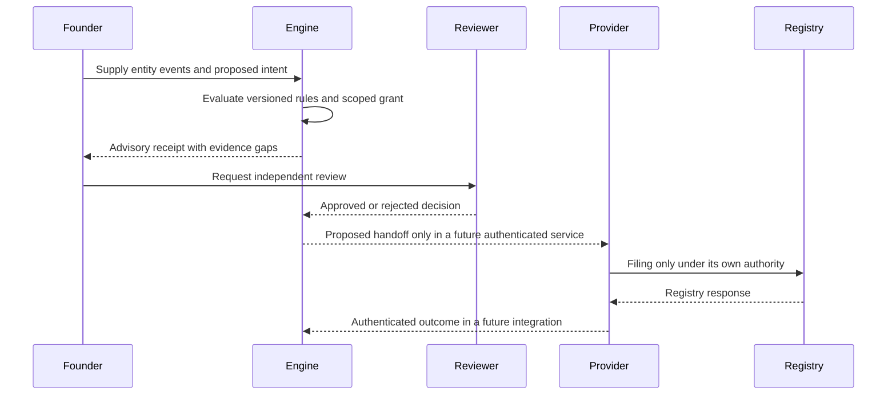

# Architecture and trust boundaries

## Request path

Only the first engine evaluation and exact-input offline receipt recomputation exist today. Every external interaction in the sequence is a design boundary, not implemented connectivity. See the [expanded network architecture](NETWORK_ARCHITECTURE.md), including the high-contrast evidence and authority model.

## Authority invariant

An action can move toward provider handoff only when all of these are true: the action is supported for the entity and jurisdiction; a current, scoped grant belongs to an authenticated principal; an independent authorized reviewer approves; the chosen provider accepts the scope; and the user sees the final terms. The v0.2 evaluator checks only the local grant and independent-approval fields. It cannot authenticate people or establish legal authority.

## Evidence invariant

Every material claim should link to a source event, jurisdiction-pack version, underlying artifact, verification method, time and reviewer. A hash alone proves neither who supplied a document nor whether a government accepted a filing. This release therefore never marks an obligation legally complete.

## Production integration requirements

- Identity: tenant-scoped authentication, MFA, signed delegated authority, revocation and separation of duties.
- Rules: local professional approval, effective-date migration, cited official sources, exception management and change notices.
- Evidence: encrypted storage, source authentication, retention and deletion policies, access logs, regional data handling and independently trusted signing.
- Provider operations: contracts, qualification, liability allocation, service levels, escalation, disputes and transparent commercial incentives.
- Agent runtime: least privilege, no direct registry or payment credentials, prompt-injection resistance, bounded tools, human review and full action trace.
- Reliability: idempotent jobs, deadline escalation, manual fallback, backup/restore drills and incident response.

## Boundary with incumbent providers

Northwest or another registered agent can receive statutory notices in a supported US state; Entity Continuity should track that relationship and the resulting authenticated notices. Qualified law firms provide legal advice. Accountants maintain the books and make professional determinations. Government registries are the authoritative source for filings. Cloud and data-center suppliers perform infrastructure services. This platform coordinates, measures and preserves evidence across these parties, and cannot assert their authority on their behalf.
