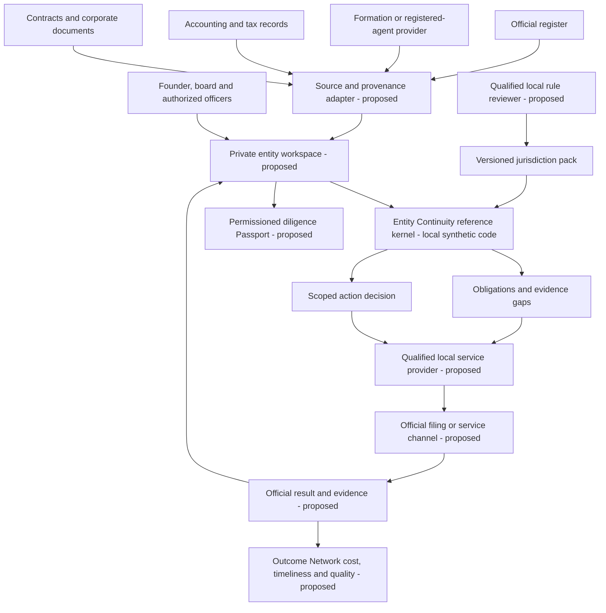
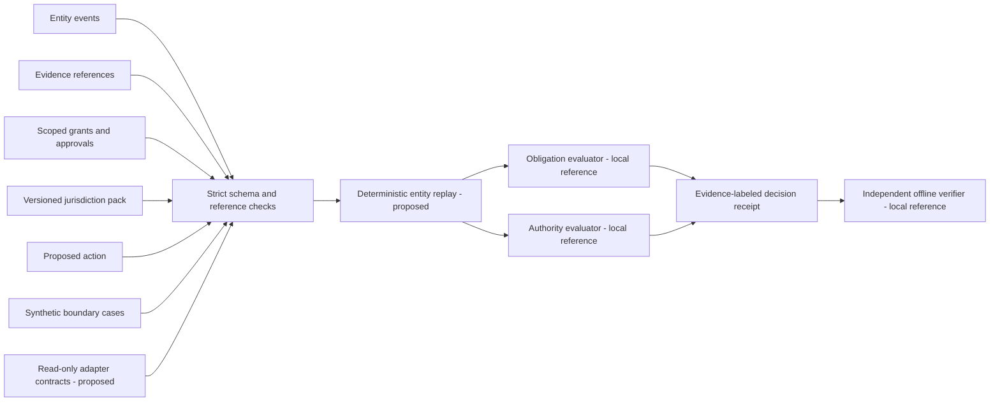
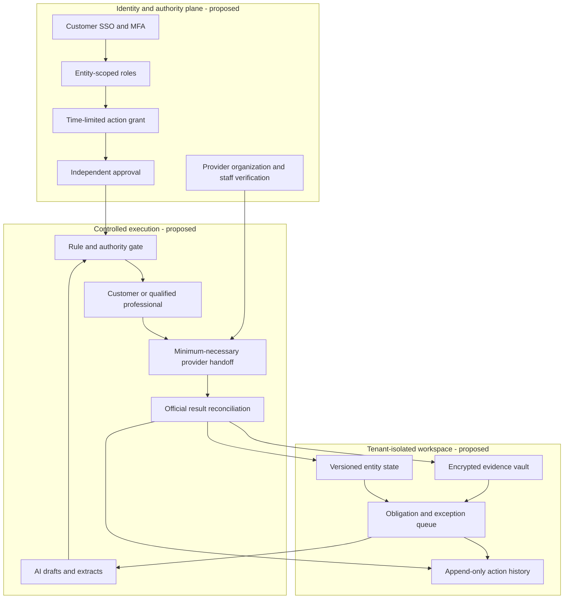
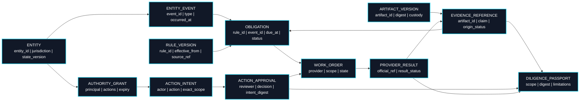
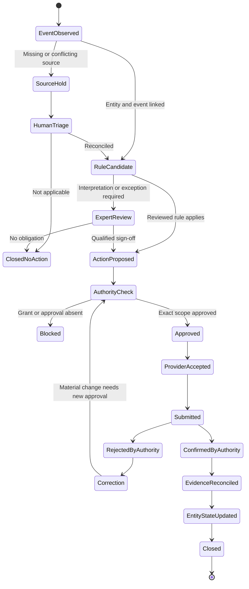
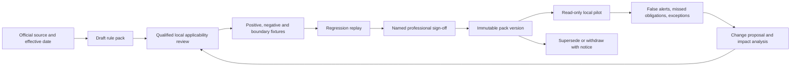
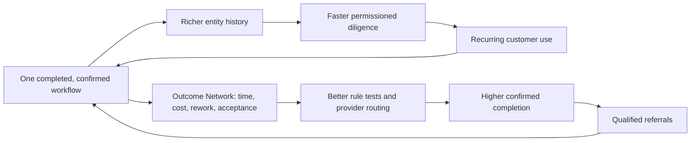

# Entity Continuity Network: system architecture

This is the proposed architecture for a cross-border entity operating network. The repository currently implements only the **local synthetic reference engine and offline verifier**. The engine evaluates one entity and a `SYNTHETIC_REFERENCE` jurisdiction pack, returns `open` or `overdue` obligations and `deny` or `reviewable` intent decisions, and emits a deterministic digest. The verifier recomputes that exact local result. Neither authenticates identities, verifies evidence origin, connects to registries or providers, completes filings, or provides legal or tax advice.

The first proposed production corridor is an Egypt-based founder operating a defined US entity type. Other countries require their own reviewed rules, provider authority, data-handling design, and operating tests. No global coverage is claimed by this document.

## 1. Product context and responsibility

The registry or other official authority determines whether a filing is effective. A provider owns its professional work. The customer retains corporate decision rights. The platform records, coordinates and checks the flow; an AI assistant may prepare a recommendation but cannot supply legal authority or professional sign-off.

## 2. Open-source monorepo modules

The stable OSS contract should contain the entity/event schema, pack schema and effective-date rules, grant and approval semantics, evidence labels, receipt format, verifier, synthetic regression cases, and connector interfaces. Versioned entity replay and real adapters are **roadmap items**. The current verifier detects changed local inputs or receipt fields; it is not a signature or source attestation.

## 3. Commercial service and compartments

Tenant isolation means a provider assignment sees only the entity, action and records needed for that assignment. Provider access expires at completion or revocation. Credentials for a registry, bank or filing channel must remain with the authorized party, not an unsupervised agent. Publication and diligence sharing are separate, explicit grants.

## 4. Evidence and authority data model — high contrast

This deliberately uses a flowchart instead of Mermaid `erDiagram` rows. Every record has an explicit dark fill and white text, so field labels remain readable in GitHub's light and dark appearances.

The current case file has `entity`, `events`, `evidence`, `grants`, `approvals` and `intents`; the pack has `obligations`. The normalized, versioned records above are a **target schema**, not a migration already implemented. A SHA-256 digest binds bytes relative to a retained reference; it does not establish who issued those bytes. `origin_status` must distinguish `customer_reported`, `provider_attested`, `registry_confirmed`, and `unverified`. A claimed status must never be silently upgraded to authenticated completion.

## 5. Authority decision and filing lifecycle

Each transition should retain actor identity, timestamp, entity and action versions, rule version, approval reference, provider, and resulting evidence. `Submitted` is not `ConfirmedByAuthority`. The current engine stops at a local `deny` or `reviewable` advisory receipt; it does not execute this state machine.

## 6. Jurisdiction pack release and rollback

The present `US-DE-SYNTHETIC` pack has invented deadlines and cannot be promoted by merely changing its status field. Production packs need official sources that actually support each rule, applicability tests for entity types, effective dates, exceptions, a named reviewer, and a way to withdraw a wrong version without deleting its history.

## 7. Outcome and commercial asset loop

This is a hypothesis to test, not guaranteed exponential growth. Use contribution margin per entity-year as the commercial unit: workspace and coordination revenue less provider delivery, professional review, connector maintenance, storage, support and payment costs. Government charges and professional fees are pass-through or separately disclosed. Key pilot metrics are missed obligations, false reminders, review minutes, time to confirmed result, provider on-time rate, evidence gaps, customer renewal and second-customer onboarding effort.

## Release gates

| Gate | Required evidence | Current status |
| --- | --- | --- |
| Reference engine | Synthetic replay, conservative evidence labels, denial of self-approval and expired grants, offline receipt recomputation | Implemented locally |
| Reviewed rule pack | Official-source mapping, local professional review, effective-date and exception tests | Not implemented |
| Read-only customer pilot | Permissioned source import, reconciliation against source counts, private diligence view | Not implemented |
| Authenticated handoff | Customer/provider identity, scoped signed approval, separation of duties, official confirmation | Not implemented |
| Repeatable network | Second customer and provider served without custom rule logic; measured contribution margin | Not implemented |

The architecture scales across jurisdictions by adding separately reviewed packs and qualified local partners. It does not assume one registered-agent license, one legal interpretation, or one data-residency rule applies worldwide.
