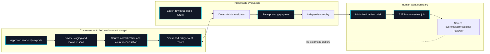
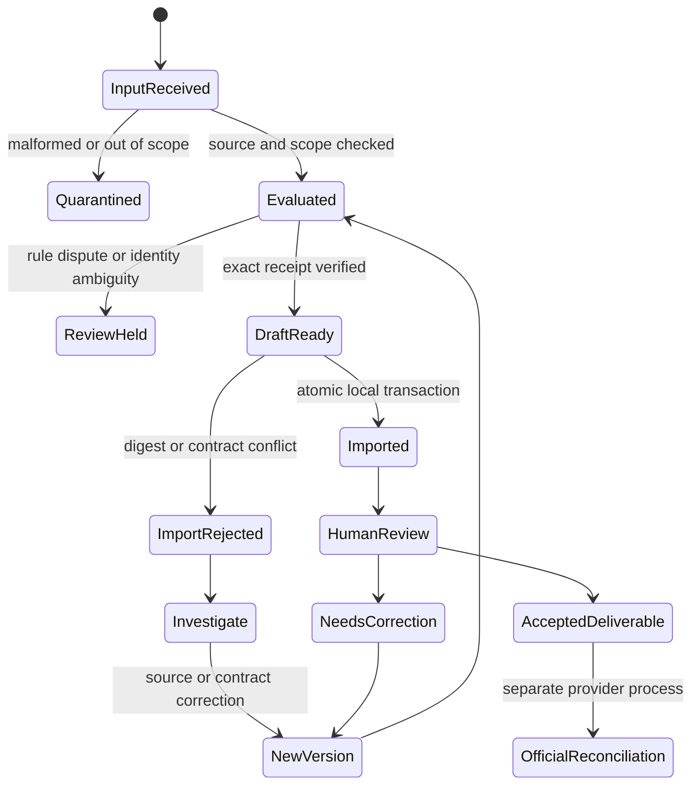

# Entity Continuity: controlled pilot runbook

The current release is an **offline synthetic reference**. This runbook defines the next bounded milestone: a customer-authorized, read-only pilot for one entity type in one reviewed jurisdiction corridor. It does not authorize filings, legal advice, provider dispatch or processing of customer identity documents in the public repository.

## Deployment boundary

The local synthetic evaluator, strict source-manifest intake, receipt, verifier and A2Z export/import exist today. The manifest's scope is self-declared; private source staging, expert-reviewed packs and authenticated review identities are **not implemented**. A real pilot must remain read-only until those controls have been built and independently reviewed.

## Preconditions for the first customer-authorized pilot

1. Obtain a written scope naming the customer entity, allowed source classes, responsible operator, retention period, deletion method and permitted reviewers.
2. Select one entity type and one jurisdiction corridor. Have a qualified local professional review each proposed rule, source citation, effective date, applicability condition, exception and synthetic regression test.
3. Use a private workspace with encrypted storage and restricted access. Do not put customer source data, credentials or identity documents in GitHub issues, fixtures, logs or A2Z public jobs.
4. Agree on a manual baseline: a human reviewer independently lists obligations and evidence gaps before seeing engine output. Keep disagreements and unknowns; do not force a binary answer.
5. Rehearse rollback, backup/restore, access revocation and deletion with synthetic records. Assign an incident contact and manual deadline escalation path.

## Pilot workflow and evidence to retain

| Step | Operator action | Retained evidence | Stop condition |
| --- | --- | --- | --- |
| Intake | Verify customer permission and source inventory | Scope, source count, import digest | Source outside scope or count mismatch |
| Normalize | Map records to entity and event versions | Mapping version, rejected rows | Ambiguous entity identity |
| Evaluate | Pin pack version and `as_of` date | Exact inputs, receipt, code version | Missing reviewed rule or invalid input |
| Compare | Independent professional adjudicates outputs | False alerts, misses, disagreements | Unresolved statutory interpretation |
| Handoff | Redact and verify a review brief | Bundle digest, source receipt, reviewer scope | Personal data or authority ambiguity |
| Review | Named human accepts or rejects deliverable | Decision, changes requested, time spent | No independent reviewer |
| Reconcile | Record source-confirmed outcome separately | Official reference if one exists | Only worker claim available |

The reviewer can mark an A2Z deliverable accepted without closing the underlying entity obligation. A disputed rule or changed source creates a new version and replay; history must remain inspectable.

## Testable pilot measures

Define denominators before the pilot. Report all eligible cases, exclusions and unresolved cases, not only accepted work.

- **Source reconciliation coverage:** imported source records / in-scope source records. Investigate every missing record.
- **Obligation recall against manual baseline:** manually confirmed applicable obligations emitted by the engine / manually confirmed applicable obligations. This is a pilot comparison, not an estimate of legal completeness.
- **False reminder rate:** engine reminders rejected by the qualified reviewer / all engine reminders reviewed.
- **Evidence-gap resolution time:** time from first gap detection to reviewer-confirmed adequate evidence; report censored unresolved cases separately.
- **Review effort:** named human minutes per entity-month and per accepted review.
- **Handoff failure rate:** rejected, duplicated or unresolved imports / attempted imports.
- **Confirmed completion:** source-authenticated official outcomes / actions requiring official outcome; a submitted action is not a confirmed action.

No numeric SLA or accuracy target should be public until a representative baseline exists. Production rollout requires acceptable missed-obligation behavior, a low false-alert burden for reviewers, working exception handling and a documented manual fallback.

## Failure and recovery drills

Test at least a changed source after receipt generation, a duplicate import, a conflicting job ID, a write failure after one job, a missing source record, a revoked reviewer and an unavailable provider. A2Z v0.2 now records the source receipt and bundle digest, rejects conflicts, and rolls back all job writes if one fails. It does not implement provider or official reconciliation.

## Commercial decision gate

The first paid offer should be a narrow, human-reviewed evidence-gap service only after the read-only pilot is reliable. Price from observed labor and support cost, not from synthetic A2Z estimates. Report customer revenue, professional delivery, worker time, review, connector operations, compute, support, rework and pass-through fees separately. Expansion to another corridor requires a new qualified rule review and customer-visible coverage statement. This is a proposal, not a claim that the current repositories can accept production customers.
