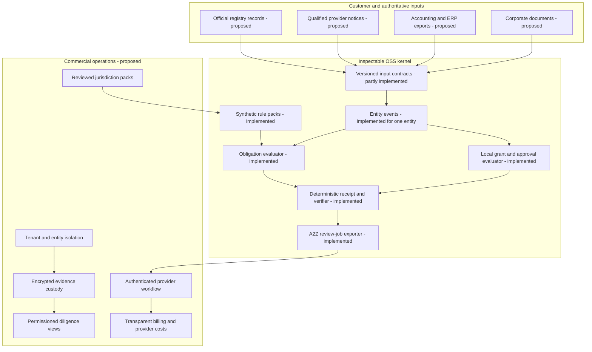
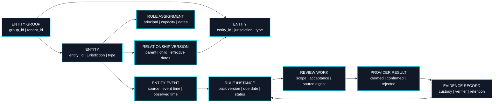
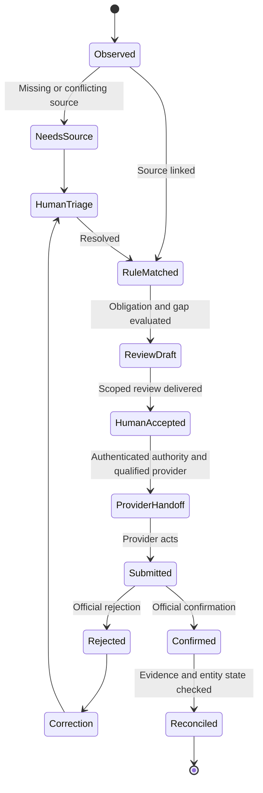

# Entity Continuity: production deepening plan

This document separates the **implemented synthetic kernel** from a deployable cross-border operating network. The next product milestone is one customer-authorized, read-only corridor pilot with a qualified local professional. Global filing coverage, autonomous legal decisions and a provider marketplace are not current capabilities.

## Capability map

The OSS kernel should remain independently replayable. Hosted services may add identity, access controls, operational support and qualified providers, but should not hide rule semantics or change an obligation result without a versioned rule or source correction.

## Multi-entity target model

The current case contains one entity. A useful production customer may have parents, subsidiaries, branches, service providers, beneficial owners, officers and intercompany agreements. These relationships must be versioned and scoped, rather than inferred from names.

Target invariants: tenant ID is explicit on every row; entity relationship edges have effective dates; events carry both occurrence and observation time; a source correction appends a new version; one work order refers to a precise rule instance and source digest; provider claims stay distinct from official confirmation; deletions follow retention and legal-hold policies. This normalized model is a **design**, not a migration shipped in v0.3.

## Operational loop

Current code reaches `ReviewDraft` using synthetic inputs and can import that draft into a local A2Z board. It does not move to `ProviderHandoff` or later states. A2Z acceptance means a reviewer accepted work, not that the obligation was discharged.

## Reliability and control requirements

| Area | Required production behavior | Test before launch |
| --- | --- | --- |
| Source ingestion | Permissioned, read-only first; source identity and record-count reconciliation | Missing, duplicate and changed-source fixtures |
| Rule packs | Official citation, effective dates, entity applicability, exception fixtures, named professional review | Positive, negative and boundary cases per rule |
| Time | Jurisdiction calendar, holidays, clock source, event time versus observation time | Backdated and timezone-boundary fixtures |
| Authority | MFA, signed exact-scope grants, expiry, revocation, independent approver | Replay, self-approval, expired grant and wrong-entity tests |
| Evidence | Encrypted custody, origin authentication, artifact versioning, access log | Tamper, wrong-tenant and missing-artifact tests |
| Work delivery | Idempotent handoff, bounded retries, dead-letter queue and manual fallback | Crash between send and acknowledgment; duplicate delivery |
| Tenant isolation | Row and object-level enforcement, least privilege and deletion workflows | Cross-tenant query and export tests |
| Operations | Deadline escalation, incident response, backups and restore drills | Restore-time and missed-alert exercises |

Target service indicators should be set only after a baseline pilot. Measure source reconciliation coverage, missed obligations, false reminders, evidence-gap resolution time, human-review minutes, accepted work rate, provider on-time rate, rework and time to confirmed official result. A dashboard that reports only completed tasks would hide the important failure modes.

## Sequenced build

1. **Reference hardening:** versioned schemas, strict cross-reference validation, deterministic due offsets, summary counts, replay tests and the A2Z draft boundary. This release implements those local pieces.
2. **Read-only pilot:** signed customer consent; private source imports; one entity type and one corridor; qualified professional adjudicates every rule; compare system output with a manual baseline. No outbound filings.
3. **Controlled review operations:** authenticated customer and provider identities, scoped work terms, independent review, evidence custody and auditable handoff. Measure acceptance and rework.
4. **Provider result reconciliation:** official references and status checks, exception handling, revocation, correction and deadline escalation. A submitted result must never be treated as confirmed.
5. **Multi-entity expansion:** versioned ownership and officer graph, intercompany events, cross-jurisdiction dependency tests and permissioned group reporting.
6. **Commercial network:** repeatable onboarding across multiple independent customers, partner agreements, transparent incentives, SLA measurement and observed entity-year contribution.

## Unit economics and expansion criteria

Use explicit denominators:

`entity-year contribution = workspace revenue + coordination revenue - provider delivery - professional review - support - connector operations - storage/compute - payment fees - rework reserve`

`cost per accepted review = (worker payout + professional review + compute + support + rework) / accepted reviews`

`confirmed completion rate = officially confirmed obligations / obligations requiring official action`

Keep government charges, professional fees and referral commissions separately disclosed. Track customer-acquisition cost, onboarding labor, annual retention and second-customer setup hours. Expansion to another jurisdiction is justified only after the current corridor has reviewed source coverage, low false-alert burden, reliable exception handling and positive contribution on actual customer data. No exponential or compounding growth is implied by the architecture alone.
