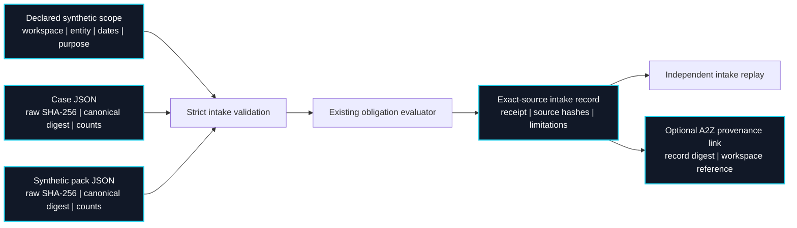

# Read-only intake protocol

Entity Continuity v0.5 adds a **synthetic-only** source-manifest path. It validates a declared evaluation scope, exact input bytes, parsed JSON content and record counts before invoking the deterministic evaluator. The manifest is self-declared; it is **not authenticated consent**. `workspace_id` is a reference namespace, **not tenant isolation**.

## Source-to-review lineage



The CLI rejects duplicate JSON keys, non-finite values, invalid UTF-8 and oversized source files. Manifest inventory counts must equal the parsed event, evidence and rule counts. The raw SHA-256 detects byte changes; the canonical digest binds the parsed objects passed to evaluation. Neither digest establishes who created the file or whether its content is true.

## Run the synthetic fixture

```bash
PYTHONPATH=src python3 -m entity_continuity.intake_cli \
  examples/synthetic-read-only-intake-manifest.json \
  examples/egypt-to-us-synthetic-case.json \
  examples/us-de-synthetic-pack.json \
  --as-of 2026-09-23 --output /tmp/entity-intake-record.json

PYTHONPATH=src python3 -m entity_continuity.intake_verify_cli \
  examples/synthetic-read-only-intake-manifest.json \
  examples/egypt-to-us-synthetic-case.json \
  examples/us-de-synthetic-pack.json \
  /tmp/entity-intake-record.json --as-of 2026-09-23
```

The intake record includes the existing obligation receipt. To create A2Z review drafts, generate the ordinary Entity Continuity receipt and bundle from the **same** case, pack and date, then supply `--intake-manifest` and `--intake-record` to the A2Z import command. A2Z independently verifies the intake record and requires its embedded receipt to match the handoff receipt. It stores only the intake digest and workspace reference, not the intake file.

## Contract fields

| Field | Meaning | Current limit |
| --- | --- | --- |
| `scope` | Exact synthetic read-only protocol identifier | Other scopes rejected |
| `workspace_id` | Stable namespace for local lineage | No access control |
| `entity_id`, `jurisdiction` | Exact case/pack match | One entity per case |
| `declared_scope.reference` | User-supplied scope reference | Not independently signed or authenticated |
| `declared_scope.valid_from/valid_until` | Allowed evaluation date window | No identity proof or revocation feed |
| `sources.*_sha256` | Hash of exact UTF-8 file bytes | Origin not authenticated |
| `sources.*_json_digest` | Canonical parsed-content digest | Only protects the evaluated object |
| Source counts | Explicit events, evidence and rules | Count reconciliation, not completeness proof |
| `record_digest` | Digest of the output record | Not a signature |

## Production prerequisites

The first real pilot still needs a customer-signed scope, authenticated operator and reviewer identities, private encrypted source custody, deletion/retention policy, source-system reconciliation, a professionally reviewed jurisdiction pack, tenant isolation, backup/restore drills and an incident path. The public synthetic fixture must never be relabeled as a real filing schedule. The [pilot runbook](PILOT_READINESS.md) defines the review and measurement process; this protocol supplies only the inspectable intake contract.
